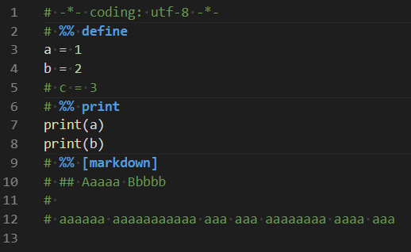
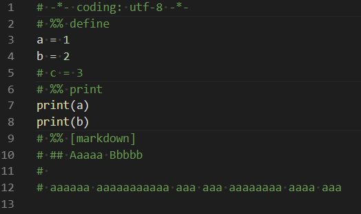

# vscode-python-highlight-cell-splitter

highlight the splitters of cells, bold them and change their color

You can custom the color by adding the following code into your `setting.json`
```json
    "editor.tokenColorCustomizations": {
        "[Default Dark+]": {
            "textMateRules": [
                {
                    "scope": "markup.heading.python.cell.splitter",
                    "settings": {
                        "fontStyle": "bold",
                        "foreground": "#40b903"
                    }
                }
            ]
        }
    },
```



↑

